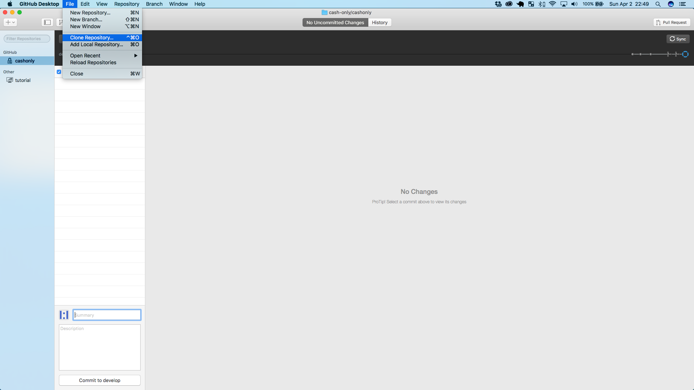
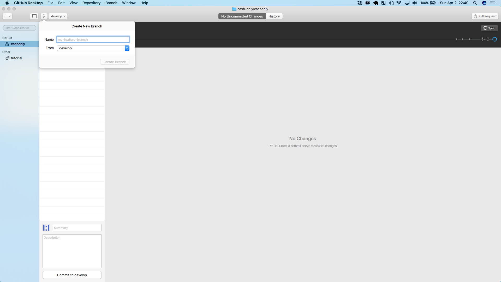

This repo is for Cash Only website. _Guard it with your life._

If you have any questions, please email: [haldun@cashon.ly](mailto:haldun@cashon.ly)

# Introduction #

Currently, _Cash Only_ relies on the following frameworks and resources:

* AWS Elastic Beanstalk (EB), which includes:
    * AWS Elastic Compute Cloud (EC2)
    * AWS Relational Database Service (RDS)
    * AWS Simple Storage Service (S3)
    * AWS Elastic Load Balancer (ELB)
    * AWS Route 53
* PostgreSQL
* Django (Python 3.4)
* GitHub & GitHub Desktop
* Atom

# Using git & git Branching for Cash Only Feature Development #

This document is meant to outline how version control is expected to be used for feature development at Cash Only. Please review this document regularly to ensure continued use of our most up-to-date git policy. A separate document for hotfixes can be found here.

_Updated: Sunday, April 2, 2017._

## Overview ##

Cash Only uses Github as our online repository. All new branches should first be created from the current version of the `develop` branch and pulled back so that they may all be merged properly later on. Please follow the steps outlined below every time you’re starting a new project.

The following draws from [this article](http://nvie.com/posts/a-successful-git-branching-model/) and implements a more developer-friendly GUI format. It is recommended that you read that before you continue, as this is essentially a summary steps article with the commentary removed.

## Step 1: Ensure that your local repo is up-to-date with the remote develop ##

Before starting any development, __you MUST ensure that your local repo is up-to-date with the remote server.__

If you do not already have a GitHub account, please create one and contact the administrator for access to the Cash Only repo. Once you've been granted access, you must create a local clone of the repo. We will use GitHub Desktop to facilitate this workflow (significantly!).

Having installed GitHub Desktop, please click on `File > Clone Repository...` and select `cash-only/cashonly` from the list. You will be prompted to clone the repo locally, select an easy-to-remember location (preferably in an area that can easily be backed up), like your Dropbox.



## Step 2: Create a new local branch ##

At this point, you should either be assigned an issue through GitHub or are prompted to create a new one. Go ahead and create a new issue on the GitHub website and copy the title of the issue, including the `#[number]` part. This latter part allows any commits made to the branch to appear in the issue for super simple tracking.

Once you've copied the name of the issue, go back to GitHub Desktop and click on the `Add a branch` button, paste the issue title in the `Name` box and make sure that you branch from `develop`. Once you've branched, open Atom (this is the recommended software for all development, no official support is provided for other third party tools like Sublime Text). Click on `File > Add Project Folder...` and select the root folder (make sure you select the `cashonly` folder with `.git` inside it).



## Step 3: Develop on your local branch ##

Before beginning development, check to ensure that the name of your branch appears on the lower right corner of the Atom screen. If not, go back to GitHub Desktop and ensure that the correct branch is selected. Develop as you normally would on your local branch. You are free to edit as many documents as you like, though ideally don’t go beyond editing the files that are necessary to implement your feature. The rule of thumb is that each commit (and by extension, each pull request) should have as few changes as possible to make sure that the desired feature is implemented. Remember: *simple is better than complex!*

If you want to test your code, run the following in the terminal to run a server locally:

```shell
$ source activate ebenv
$ python manage.py runserver
```

Make sure that your virtual environment at `ebenv` is set up correctly. If not, please contact the administrator for assistance. Alternatively, if you get the following error, you’re not currently running a PostgreSQL server locally:

```
django.db.utils.OperationalError: could not connect to server: Connection refused
	Is the server running on host "localhost" (::1) and accepting
	TCP/IP connections on port 5432?
could not connect to server: Connection refused
	Is the server running on host "localhost" (127.0.0.1) and accepting
	TCP/IP connections on port 5432?
```

To fix, please go to Postgres.app and activate your server, then rerun the second line. Once you are done, enter a simple summary and a more detailed description of the changes being pushed (taking care to mention the `#[number]` in either the summary or description section). Once you're done, press the `Commit` button to make the changes. In order to share with the rest of the developers, click the `Sync` button on the top right corner to sync your changes with the online repo.

## Step 4: Merge to develop ##

In order to incorporate the new feature into the upcoming release, it must be merged back into develop. To do so, press the `Pull Request` button. This will create a new sub-issue that can be assigned to another developer for review and merged back into develop. No matter how trivial the changes, please always have another developer review your work when it's ready for merge.
